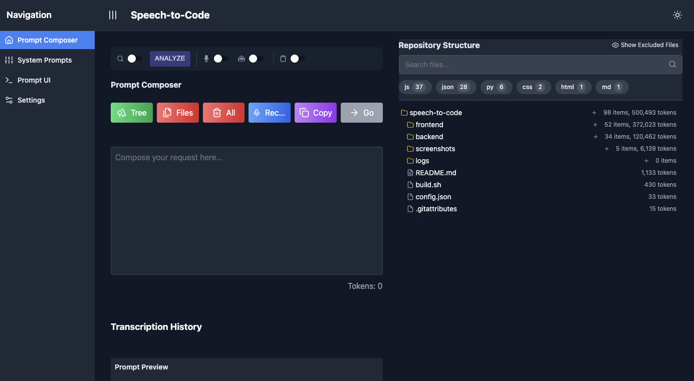

# Speech-to-Code

Speech-to-Code is a web application that leverages Large Language Models (LLMs) to convert spoken language into executable code. This project aims to streamline the code generation process by allowing developers to express their ideas verbally and have them translated into functional code.

## 📸 Application Screenshots

### 🎯 Compose Your Prompt
Combine speech, repository files, and manual text input in our intuitive prompt composer:


### 💬 Use LLM APIs Directly
Sidestep rate limits and outages by using LLM APIs direcrtly:


### 📋 Review and Copy Code
Easily review and copy the generated code:


### ⚙️ Manage System Prompts
Customize and organize your system prompts:


## ✨ Key Features

### 🎯 Advanced Prompt Composer
- Combine speech, repository files, and manual text input
- Real-time audio visualization for voice input
- Smart file suggestions based on context
- Preview and edit prompts before submission

### 🤖 Multi-Model Support
- Integration with multiple LLM providers (OpenAI, Anthropic)
- Customizable model parameters
- Cost tracking and display
- Model-specific optimizations

### 📁 Repository Integration
- Interactive file viewer for repository navigation
- Smart file combinations for context
- File-based suggestions
- Repository structure visualization

### 💬 Chat Sessions Management
- Persistent chat history with automatic saving
- Session organization and management
- Soft delete functionality for chat sessions
- Automatic chat naming based on context
- Local timestamp display for all messages

### 🎤 Transcription Management
- Real-time speech-to-text conversion
- Transcription editing and refinement
- Voice input visualization

### 💡 System Prompt Management
- Create and edit system prompts
- Organize prompts by category
- Quick prompt selection
- Version control for prompts

### 🎨 User Experience
- Dark/Light mode toggle
- Two-column layout for better workflow
- Responsive design
- Copy-to-clipboard functionality

### ⚙️ Advanced Settings
- Environment variable management
- Repository path configuration
- API key management
- Port configuration

### 📝 Logging and History
- Comprehensive session logging
- Chat history persistence
- Automatic log directory management
- Easy access to past conversations

## 🚀 Getting Started

### 📋 Prerequisites

Before you begin, ensure you have installed:
* [Node.js and npm](https://nodejs.org/en/download/) (latest version)
* [Python](https://www.python.org/downloads/) (version 3.7 or later)
* A Windows/Linux/Mac machine with command line access

### 🔧 Installation

1. **Clone the repository**
   ```bash
   git clone https://github.com/dharllc/speech-to-code.git
   cd speech-to-code
   ```

2. **Make the build script executable**
   ```bash
   chmod +x build.sh
   ```

3. **Run the build script**
   ```bash
   ./build.sh
   ```
   The script will:
   - Install necessary dependencies
   - Set up a Python virtual environment
   - Create .env files with placeholders
   - Create required directories for logs and chat sessions
   - Set appropriate permissions

4. **Configure Environment Variables**
   Navigate to the Settings page to configure:
   - OpenAI API Key
   - Google API Key
   - Anthropic API Key
   - Repository Path

## 🚀 Running the Application

1. **Configure ports** (optional)
   Edit `config.json` in the root directory:
   ```json
   {
       "frontend": {
           "port": 3000 
       },
       "backend": {
           "port": 8000 
       }
   }
   ```

2. **Start the frontend**
   ```bash
   cd frontend
   npm start
   ```

3. **Start the backend**
   ```bash
   cd backend
   source venv/bin/activate
   uvicorn main:app --reload --log-level debug
   ```

Access the application at `http://localhost:3000` 🌐

## 📁 Project Structure

```
speech-to-code/
├── backend/
│   ├── .env
│   ├── main.py
│   ├── llm_interaction.py
│   ├── model_config.py
│   ├── system_prompts.json
│   ├── context_maps/
│   └── utils/
├── frontend/
│   ├── public/
│   └── src/
│       ├── components/
│       ├── services/
│       └── config/
├── logs/
│   └── chat_sessions/      # Persistent chat history storage
└── README.md
```

## 🔧 Troubleshooting

### Common Installation Issues

**Backend dependencies failing to install:**
If you encounter build errors with packages like `grpcio`, `tiktoken`, or `tokenizers` on macOS:

1. **Upgrade pip and build tools:**
   ```bash
   cd backend
   source venv/bin/activate
   pip install --upgrade pip setuptools wheel
   ```

2. **Install problematic packages with precompiled wheels:**
   ```bash
   pip install --only-binary=all grpcio tiktoken tokenizers
   ```

3. **Install remaining dependencies:**
   ```bash
   pip install uvicorn fastapi python-dotenv openai anthropic google-generativeai
   ```

**"uvicorn not found" error:**
- Ensure you've activated the virtual environment: `source venv/bin/activate`
- Install uvicorn directly: `pip install uvicorn`

**"REPO_PATH environment variable is not set" error:**
- Create a `.env` file in the `backend/` directory
- Add: `REPO_PATH=/path/to/your/repositories`
- Example: `REPO_PATH=/Users/username/Documents/GitHub`

### General Issues

If you encounter other issues:
1. Verify API keys in Settings
2. Check dependencies
3. Ensure both servers are running
4. Check the logs directory for detailed session logs
5. Verify proper permissions on the logs directory

For detailed logs, check:
- Console output of both servers
- Session logs in `logs/sessions/`
- Application logs for debugging

## 🤝 Contributing

We welcome contributions! Check our issues page for current tasks or suggest new features.

## 📬 Feedback

Have suggestions? Email me at sachin@dharllc.com

## 📄 License

This project is licensed under the [MIT License](https://opensource.org/licenses/MIT) 📜
