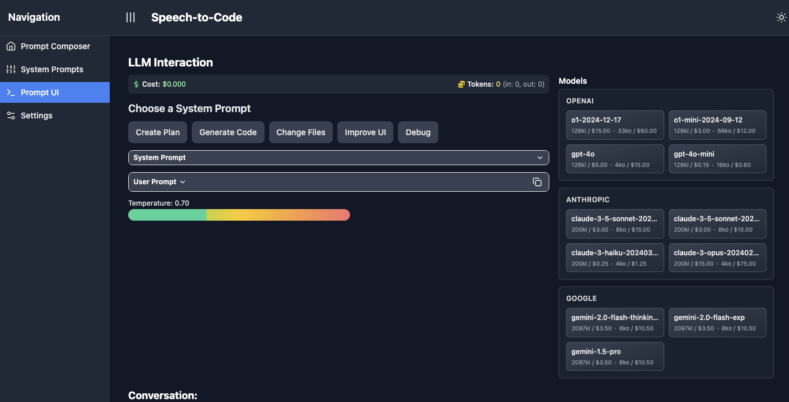

# Speech-to-Code

Speech-to-Code is a web application that leverages Large Language Models (LLMs) to convert spoken language into executable code. This project aims to streamline the code generation process by allowing developers to express their ideas verbally and have them translated into functional code.

## Usage

Here is an example workflow of the Speech-to-Code application:

### Write a prompt, combining speech, the repo tree, and current source code


### Prompt an LLM and copy the code



### Manage system prompts


## Prerequisites

Before you begin, ensure you have met the following requirements:
* You have installed the latest version of [Node.js and npm](https://nodejs.org/en/download/)
* You have installed [Python](https://www.python.org/downloads/) (version 3.7 or later)
* You have a Windows/Linux/Mac machine with command line access

## Installation

To install Speech-to-Code, follow these steps:

1. Clone the repository
   ```
   git clone https://github.com/dharllc/speech-to-code.git
   cd speech-to-code
   ```

2. Make the build script executable
   ```
   chmod +x build.sh
   ```

3. Run the build script
   ```
   ./build.sh
   ```
   This script will:
   - Install necessary dependencies for both frontend and backend
   - Set up a Python virtual environment
   - Create .env files with placeholders for API keys if they don't exist

4. Configure environment variables
   After running the application, navigate to the Settings page to configure your environment variables, including:
   - OPENAI_API_KEY
   - GOOGLE_API_KEY
   - ANTHROPIC_API_KEY
   - REPO_PATH (path to your local GitHub repositories)

## Running the Application

To run Speech-to-Code, follow these steps:

1. Start the frontend:
   ```
   cd frontend
   npm start
   ```

2. In a new terminal, start the backend:
   ```
   cd backend
   source venv/bin/activate
   uvicorn main:app --reload --log-level debug
   ```

The application should now be running. Access the frontend at `http://localhost:3000` in your web browser.

## Project Structure

```
speech-to-code/
├── backend/
│   ├── .env
│   ├── main.py
│   ├── llm_interaction.py
│   ├── model_config.py
│   ├── system_prompts.json
├── frontend/
│   ├── public/
│   ├── src/
│   │   ├── components/
│   │   ├── services/
│   ├── .env
│   ├── .gitignore
│   ├── README.md
│   ├── package-lock.json
│   ├── package.json
│   ├── postcss.config.js
│   └── tailwind.config.js
├── logs/
├── .gitattributes
├── .gitignore
├── package-lock.json
├── README.md
```

## Key Components

### Backend
- `main.py`: The main FastAPI application
- `llm_interaction.py`: Handles interactions with Language Learning Models
- `model_config.py`: Configuration for different language models
- `system_prompts.json`: Stores system prompts for LLM interactions

### Frontend
- `src/components/`: React components for the user interface
- `src/services/llmService.js`: Service for interacting with the backend LLM API
- `src/App.js`: Main React application component
- `src/components/Settings.js`: Component for managing environment variables and repository settings

## Features

- Prompt Composer: Craft and edit prompts for code generation
- System Prompt Management: Manage and customize system prompts
- LLM Interaction: Interact with various Large Language Models
- Settings: Configure environment variables and repository settings
- Dark Mode: Toggle between light and dark themes

## Troubleshooting

If you encounter any issues:
- Ensure all API keys are correctly set in the Settings page
- Check that all dependencies are installed correctly
- Verify that both frontend and backend servers are running

For more detailed error messages, check the console output of both frontend and backend servers.

## Contributing

Contributions to Speech-to-Code are welcome. Please refer to the repository's issues page for current tasks or to suggest new features.

## Feedback

Please send feedback via email to sachin@dharllc.com

## License

This project uses the following license: [MIT License](https://opensource.org/licenses/MIT).
